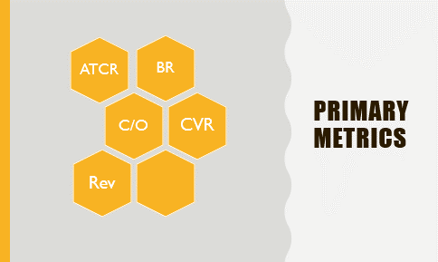
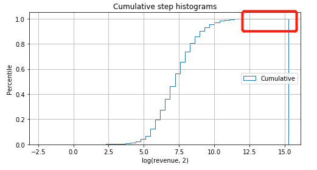

## H&M A/B Testing Project

This is the project about AB Testing, from **data cleaning and traffic chec**k by leveraging **MySQL** to perform overall **multivariate analysis** and **deep dive** by different categories using **Python**. I used **Z-Test** for binomial distribution for ratio metrics (**Bounce Rate, ATCR, Checkout Rate, Conversion Rate**) and **Mann Whitney U tests** for continuous variables (**Revenue**). Based on my analysis, I came up with actionable and insightful recommendations and solutions. And also, I provided next steps based on current situation.

### Introduction

<p align="center">

</p>

H&M is a multinational fast fashion company who emphasis on high fashion at prices significantly below those of competitors, being 'Fashion and quality at the best price'. H&M deals in fashioned apparels, shoes, dress, tops, pants and skirts


Recently, the product analyst team decided to make some UX changes on product page. For example, they wanted to test whether the product details located at the bottom of the page may be distracting users from clicking Add-to-Cart buttom. Therefore, they came up with ideas of moving the product details to various location, such as right below the Add-to-Cart buttom or making the image smaller and moving up the details a bit. After discussion with product manager and engineers, they designed an A/B Testing (hereinafter called 'Test 1') with two variation groups and a control group as shown below.


But they did not realize there was another test (hereinafter called 'Test 3') ran on the same page by another group until they ended the test. There is the timeline of the two tests. From the picture below, we can see that both test started at April 12, 2019. Test 1 ended at May 21, 2019, while Test 3 ended earlier at May 10, 2019. 

<p align="center">

</p>

After the meeting with the other team, they figured out the content of Test 3, which is to add a free shipping banner right above the Add-To-Cart buttom. They assumed this change will remind users to realize the shipping fee in advance and consider adding more products on the cart before checkout. Here is the design of Test 3.


### Executive Summary
* Test 1 performs better when it comes to specific users like customers acquired by email and returning users. **I suggest rolling out variation 1**.

* Returning users react better on test 3. **I suggest rolling out Test 3 on returning users and test the effect when moving the banner to checkout page.**

### Assumption
* The metrics can based on customer and sesison level. In my analysis, I checked both but I prepfer to **use session level metrics** because it is a fast fashion company and customers may place multiple orders in a short time for **impulse buying**.
* The raw data has some issue with sampling, which means that some of the test groups **cannot perform deep dive because of the small traffic**. Especially in this situation, there is an overlap of the two tests and we have to perform **multivariate analysis** by dividing sample to smaller groups.
* Of all the analysis and calculation on this report, they have all went through the **P-Value trend test**, which means that all the significance are stable over the time and reliable.

### Traffic Flow

From the image above, we can see the users will finish the flow before they finally place an order.
* Land on the product page to have more information of the item they choose
* Add the items to cart if they intend to buy them
* Forward to checkout page and fill all the information to place an order
* Click place-order buttom and convert

(Users may leave without any actions on the page on the product or cart page)

### Metrics
For this analysis, I used the following metics to track the performance of the test.
* Primary Metrics: ATCR (Add-To-Cart Rate) and Rev (Average revenue for each order)
* Secondary Metrics: BR (Bounce Rate), C/O (Checkout Rate), CVR (Conversion Rate)


### Overall Analysis - Session Level

#### Test 1 & Test 3 Result


I suggest to rolling out Variation 1 of Test 1. From the table above, we can see the Variation 1 of Test 1 have a better performance, the ATCR has a significant increase of 0.35%. Alhough there is a decrease on the average revenue, I see it as users actually read the product details and they tend to place an order more carefully. There is fewer impulse spending for each session. I see it a good sign that our customers have more information of our product. I expect it will generate a higher revenue in the future and have the brand awareness increase.


Variation 2 underperforms than Variation 1 with negative changes in metrics of BR (+11.4%), ATCR (-11.5%) and CVR (-1.19%). Therefore, I think it is not a good idea to move the product details by sacrificing the size of product image. 

As for Test 3, we can see the primary metrics like ATCR and revenue are falling. But there is an improvement on BR and C/O, which makes sense because the free shipping banner make users aware of potential shipping fee for small order in advance, making them add more items on cart and have a less abandon rate for unexpected shipping fee when checkout.

### Test 1 Deep Dive
#### Cut by Visitor Type
There are four different type of visitors, which are new users, email acquired visitors, sign up with no purchase, and users with purchase history. I caluclate the performance for each type of visitor. Below is the result.


From the table above, I suggest rolling out variation 1 except for users with purchase history since there is no directional negative effect on metrics of these groups. And users who have purchase history have a decline on C/O because they may be discouraged for the higher value of cart. Therefore, I suggestion for the next step is to launch another test on this group. For example, we can perform user research by sending emails to useres who did not checkout and ask them the reason. 

#### Cut by Category
I performed deep dive to see how users who bought different kinds of categories react to our new changes. Here is the result:


I found out that products like pants and shoes have the ATCR increase since these kind of categories need more size information than others for users to make sure they fit. And for the next step, I suggestion is that we can perform clustering analysis to apply this pattern and to see if any other categories or users have the same pattern.

### Test 3 Deep Dive
#### Cut by Visitor Type


Users sign up without purchase went through a decline of ATCR (-2.1%) and CVR (-1.09%). From my opinion, the users may go back to add more products or leave because of free shipping banner and moreover they may tend to abandon the cart for the higher value of order. When it comes to the users with purchase history, I found that this type if visitors react better. Therefore, I suggest to rolling out Test 3 except the signed up without purchase users.

### Conclusion
#### Recommandation
I suggest rolling out Variation 1 of Test 1 for all of the users if we are appressive because because it may temporarily decrease the impulse spending but it potentially makes users pay more attention to our product details which is a benefit for our brand awareness. If we choose not taking many risk, I suggest, in this condition, to rolling out Variation 1 of Test 1 except for the users with purchase history which we saw a significant decrease on C/O.
Regarding Test 3, I suggest rolling out it for all users except sign up without purchase.

#### Next Step
For test 1, we can go further test on why returning users are more likely to abandon cart when checkout by using questionnaire.
As for Test 3, we can launch a test to check why ATCR and CVR decline for sign up without purchase group. In addition, we can check test 3 effect when moving the banner to checkout page or the browering page to see if it will have more positive changes.


### Appendix:
#### Data Cleaning and Processing
I used **MySQL** to merge the test group ID, Revenue with our main data. Then I performed **data health check** to see if the sample were evenly distributed. I checked it by two level. The first is session level and another is customer level.  
```
## Customer Level
SELECT TestGroupID, COUNT(distinct cusid) 
FROM test1
GROUP BY 1;

## Session Level
SELECT TestGroupID, COUNT(distinct SessionID) 
FROM test1
GROUP BY 1;
```

Also, I perfomed traffic check to **tease out the date when the traffic is not stable** over the period.
```
## Traffic Check
SELECT date, count(distinct SessionID)
FROM test1
GROUP BY 1
ORDER BY 1;
## Test1 was from 4-12 to 5-21. But traffic from 4-15 to 5-20 was stable
```

Some of the customers may be assigned to different test group during the test period, by which they may be affected. So I also **teased out the flipped.
```
## Tease out flipped
CREATE TEMPORARY TABLE temp_test1
SELECT TestGroupID, cusid
FROM test1
WHERE date BETWEEN '2019-04-15' AND '2019-05-20';

CREATE TEMPORARY TABLE tes1_no_flipped
SELECT *
FROM tes1
WHERE cusid NOT IN (
	SELECT distinct a.cusid
	FROM temp_test1 a JOIN test1 b
	ON a.cusid = b.cusid AND a.TestGroupID != b.TestGroupID
	WHERE b.date BETWEEN '2019-04-15' AND '2019-05-20');
```

Then I **aggregate data by both session and customer level.
```
## Aggregate Data
## Session Level
SELECT TestGroupID,
COUNT(DISTINCT CASE WHEN Bounced THEN SessionID END) AS Bounce,
COUNT(DISTINCT CASE WHEN AddedToCart THEN SessionID END) AS ATC,
COUNT(DISTINCT CASE WHEN ReachedCheckout THEN SessionID END) AS RC,
COUNT(DISTINCT CASE WHEN Converted THEN SessionID END) AS Converted,
COUNT(DISTINCT SessionID) AS Viewed
FROM tes1_no_flipped
WHERE date BETWEEN '2019-04-15' AND '2019-05-20'
GROUP BY 1;

## Customer Level
SELECT TestGroupID,
COUNT(DISTINCT CASE WHEN Bounced THEN CusID END) AS Bounce,
COUNT(DISTINCT CASE WHEN AddedToCart THEN CusID END) AS ATC,
COUNT(DISTINCT CASE WHEN ReachedCheckout THEN CusID END) AS RC,
COUNT(DISTINCT CASE WHEN Converted THEN CusID END) AS Converted,
COUNT(DISTINCT CusID) AS Viewed
FROM tes1_no_flipped
WHERE date BETWEEN '2019-04-15' AND '2019-05-20'
GROUP BY 1;
```

Then, I extracted the data and perform advanced calculation using **Python**, like **significant level, P-Value, Z-Score, Lift, etc**.

Firstly, I developed a function to perform Z-Test for **binomial distribution** like ratio metrics and the output are the **metrics, confident level, lift**.

```
def z_test_calculator(df,denominator,numerator):
    
#   INPUT:
#        df: dataframe with aggregated data
#        denominator: str
#        numerator: str

#   OUTPUT: 
#        (denominator, numerator, p_value, pct_lift, abs_lift)

    # get data
    nume_ctrl = df.loc[0, numerator]
    deno_ctrl = df.loc[0, denominator]
    nume_var = df.loc[1, numerator]
    deno_var = df.loc[1, denominator]


    # p
    p_ctrl = nume_ctrl / deno_ctrl
    p_var  = nume_var / deno_var

    # STD
    std_ctrl = math.sqrt(p_ctrl * (1 - p_ctrl) / deno_ctrl)
    std_var = math.sqrt(p_var * (1 - p_var) / deno_var)

    # Z-Score
    z = (p_ctrl - p_var) / math.sqrt(std_ctrl**2 + std_var**2)

    # P Value
    p = 1-norm.sf(abs(z))

    # Lift
    abs_lift = p_var - p_ctrl
    pct_lift = abs_lift / p_ctrl
    
    return denominator, numerator, p, pct_lift, abs_lift
```

Then, when it comes to revenue. I have to use another statistis model, called **Mann Whitney U Test**, which is the method to calculate significant level for **continuous variables**. But before that, I firstly **tease out the outliers of revenue**.


```
x = Var1_Rev.apply(lambda x: math.log(x,2))
n_bins = 50
fig, ax = plt.subplots(figsize=(8, 4))

# plot the cumulative histogram
n, bins, patches = ax.hist(x, n_bins, density=True, histtype='step',
                           cumulative=True, label='Cumulative')

# tidy up the figure
ax.grid(True)
ax.legend(loc='right')
ax.set_title('Cumulative step histograms')
ax.set_xlabel('Annual rainfall (mm)')
ax.set_ylabel('Likelihood of occurrence')

plt.show()
```


```# Test 3 revenue p-value
P1 = np.percentile(Control_Rev,99.9)
P2 = np.percentile(Var1_Rev,99.9)
P3 = np.percentile(Var2_Rev,99.9)

print(Control_Rev[Control_Rev<P1].mean(), Var1_Rev[Var1_Rev<P2].mean(), Var2_Rev[Var2_Rev<P3].mean())

scipy.stats.mannwhitneyu(Control_Rev[Control_Rev<P1],Var1_Rev[Var1_Rev<P2],use_continuity=False,alternative=None)
```

Next, I performed overall analysis and cut by dimensions
```cut = input('choose dimension to cut: [VisitorTypeID_1/CategoryID_1/PlatformID_1]:   ')

dic_final={}
for level in ['SessionID', 'CusID']:
    # Clarify Metrics
    metrics=['Bounced_{}'.format(test_num), 'SawProduct_{}'.format(test_num), 'AddedToCart_{}'.format(test_num), 
             'ReachedCheckout_{}'.format(test_num), 'Converted_{}'.format(test_num)]
    KPIs=[
        (level, metrics[0]),
        (level, metrics[1]),
        (level, metrics[2]),
        (level, metrics[3]),
        (level, metrics[4]),
        (metrics[1],metrics[0]),
        (metrics[1],metrics[2]),
        (metrics[2],metrics[3]),
        (metrics[3],metrics[4])]
    
    for p in set(df_Test[cut]):
        df_Test1=df_Test[df_Test[cut]==p]
        df_Result_cut=pd.DataFrame(df_Test1.drop_duplicates([level, groupby_col]).groupby(groupby_col)[level].count())
        
        for metric in metrics:
            df_Result_cut[metric]=df_Test1[df_Test1[metric]==1].drop_duplicates([level, groupby_col]).groupby(groupby_col)[level].count()

        for i in df_Result_cut.index:
            if i != 0:
                test_group_n = df_Result_cut.loc[[0, i],]
                test_group_n.index = [0,1]

                groupN_statistics = []
                for j in KPIs:
                    groupN_statistics.append(z_test_calculator(test_group_n, j[0],j[1]))
                key = 'TG{} - {} Level - Type{}'.format(int(i), level, int(p))
                dic_final[key] = pd.DataFrame.from_records(groupN_statistics, columns = ['denominator','numerator',
                                                                                         'Confident Level','perc_lift',
                                                                                         'abs_lift'])
print(dic_final)
```
