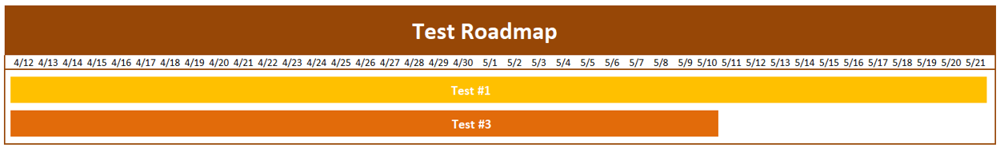
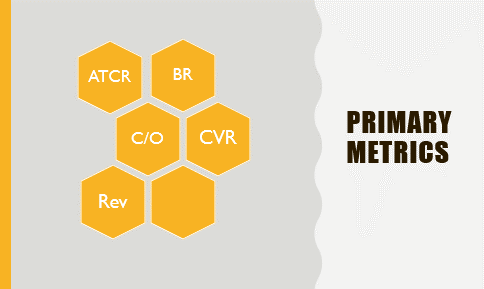
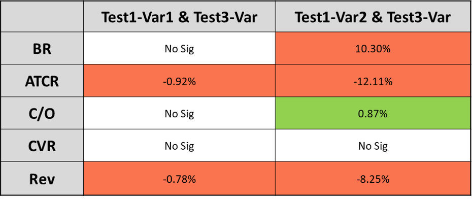
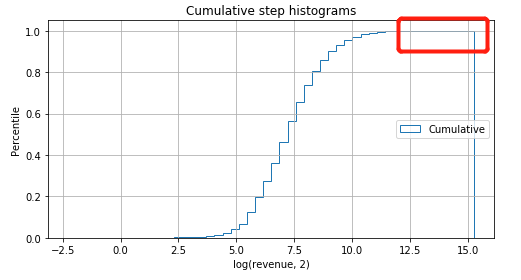

## A/B Testing Project

This project will focus on AB Testing, from **data cleaning** and **traffic check** by leveraging **MySQL** to perform the overall **multivariate analysis** and **deep dive by different categories** using **Python**. I used the **Z-Test** for binomial distribution for ratio metrics (Bounce Rate, ATCR, Checkout Rate, and Conversion Rate) and **Mann Whitney U tests** for continuous variables (Revenue). Based on my analysis, I came up with **actionable and insightful recommendations and solutions**. Additionally, I provided the next steps based on the current situation.

### Introduction

M is a multinational fast-fashion company that emphasizes on high fashion at prices significantly below those of their major competitors. Fashion and quality at the best price is the value proposition that they guarantee to their prospective clientele. M deals in fashioned apparels, shoes, dress, tops, pants and skirts.

Recently, the product analysis team decided to make some User Experience **UX changes on the product page** of the website. One of the areas of concern, for example, is that the product analysis team wanted to test whether the product details located at the bottom of the page may be **distracting users from clicking the "Add-to-Cart" button**. It is for this reason; they came up with ideas of moving the product details to various locations, such as right below the Add-to-Cart button or making the image smaller and moving up the details a bit. After discussions with the product manager and engineers, they designed an A/B Testing (hereinafter called 'Test 1') with two variation groups and a control group, as shown below.


However, they did not realize that there was **another test** (hereinafter called 'Test 3') ran on the same page by another group until they ended the test. There was a timeline for the two tests. From the picture below, we can see that both tests started on April 12, 2019. Test 1 ended at May 21, 2019, while Test 3 ended earlier on May 10, 2019.

<p align="center">

</p>

After the product analysis team met with the other team, they figured out the content of Test 3, was to add a **free shipping banner** right above the Add-To-Cart button. They assumed that this change would remind users to realize the shipping fee in advance and consider adding more products on the cart before checkout. Here is the design of Test 3.


### Executive Summary

* Test 1 performs better when it comes to specific users like customers acquired by email and returning users. **I suggest rolling out variation 1**.

* Returning users react better on test 3. **I suggest rolling out Test 3 on returning users and test the effect when moving the banner to checkout page.**

### Assumption
* The metrics were based on **customer and session-level**. In my analysis, I checked out both, but I **prefer to use session-level** metrics because it was a fast-fashion company and customers might place multiple orders in a short time when they were influenced by impulse buying in making their purchasing decisions.
* The raw data had some **issue with sampling**, and this implies that some of the test groups **cannot perform deep dive analysis** because of the small traffic. This was particularly the case in the situation at hand as there was an overlap of the two tests, and we should perform multivariate analysis by dividing the sample into smaller groups.
* Of all the analysis and calculation on this report, they have all went through the **P-Value trend test**, which means that all the significance results are stable over the time and reliable.


### Traffic Flow

From the image above, we can see the users will finish the flow before they finally place an order. 

* Land on the product page to have more information of the item they choose 
* Add the items to cart if they intend to buy them 
* Forward to the checkout page and fill all the information to place an order 
* Click place-order button and convert

(Users may leave without any actions on the page on the product or cart page)


### Metrics
For this analysis, I used the following metrics to track the performance of the test.
* Primary Metrics: **ATCR** (Add-To-Cart Rate) and **Rev** (Average revenue for each order)
* Secondary Metrics: **BR** (Bounce Rate), **C/O** (Checkout Rate), **CVR** (Conversion Rate)



### Overall Analysis - Session Level

#### Test 1 & Test 3 Result


I suggest the rolling out Variation 1 of Test 1. From the table above, we can see Variation 1 of Test 1 has better performance; the ATCR has a significant increase of 0.35%, also there was an increase in the average revenue. 

Variation 2 exhibits some underperformance than Variation 1. This can be seen in the negative changes in metrics of BR (+11.4%), ATCR (-11.5%) and CVR (-1.19%). Therefore, I think it was not an informed idea to shift the product details by sacrificing the size of the product image.

As for Test 3, we can see the primary metrics like ATCR and revenue are declining. However, there was an improvement on BR and C/O, which makes sense because the free shipping banner makes users aware of the **potential shipping fee** for small orders in advance and this is motivated by the customers to add more items on their cart and have a **lesser abandon rate** for unexpected shipping fee when they checked out.


### Test 1 Deep Dive
#### Cut by Visitor Type
There are four different types of visitors which are new users, email acquired visitors, sign up with no purchase, and users with purchase history. I calculated the performance of each type of visitor. Below are the results that I came up with.


From the table above, I suggested the rolling out of variation 1 except for users with purchase history since there was no negative directional effect on metrics of these groups. For the users who had a purchase history, they had a decline on C/O because they could have been discouraged by the higher value of the cart. Therefore, I suggested that the next step was to **launch another test** on this group. One of the avenues that I used was, for example, performing user research by sending emails to users who did not check out and find out their reason(s) for the decision that they made.

#### Cut by Category
I performed the deep dive to see how the users who bought different kinds of categories reacted to the new changes that we had implemented and rolled out. Here is the result:


I found out that products like pants and shoes had the ATCR increase since these kinds of categories needed more size and room for detailed information about the products than others for users to make sure they fit. The decision of the users or prospective clients to make a purchase was highly **dependent on the specificity** and detailed nature of the information available about the product. For the next step, I suggested that we could perform **clustering analysis** to apply the pattern and see if there were any other categories or users that had the same pattern.

### Test 3 Deep Dive
#### Cut by Visitor Type


The users that signed up without a purchase went through a decline of ATCR (-2.1%) and CVR (-1.09%). In my opinion, the users may go back to add more products or leave because of the free shipping banner. Moreover, they may tend to abandon the cart for the higher value of the order. When it comes to users with purchase history, I found out that this type of visitors reacted better. Therefore, I suggested the rolling out Test 3 except the signed up without purchase users.

### Multivariate Analysis
#### Combined Impact

When it comes to the combined effect, both groups have gone through a negative change in ATCR (-0.92% and -12.11%). Therefore, I suggest rolling out Test 1 Variation 1 only.


### Conclusion
#### Recommandation
I suggested the **rolling out Variation 1 of Test 1** for all of the users. This is because if from a business analytical point of view we are required to be **aggressive** because it may temporarily decrease the impulse spending, but it may **potentially make the users pay more attention to our product details**. This is a positive effect that is beneficial to **promoting our brand awareness**. When we choose to have a lower risk appetite, I suggested, that in this condition, to the rolling out Variation 1 of Test 1 except for the users with purchase history we saw a significant decrease on C/O. Regarding Test 3, I suggested the **rolling out it for all the users except the ones that signed up without purchase**.

#### Next Step
For test 1, we could go further and establish the reasons why the returning users were more likely to abandon the cart and check out by using a short and precise questionnaire with **open-ended and closed-ended questions**. As for Test 3, we could launch a test to **check why ATCR and CVR declined** for sign up without purchase group. Besides, we could check effects of test 3 when **moving the banner to the checkout page or the browsing page** to see whether it would have more positive changes on the purchases and by extension the sales volume.


### Appendix:
#### Data Cleaning and Processing
I used **MySQL** to merge the test group ID, Revenue with our main data. Then I performed **data health check** to see if the sample were evenly distributed. I checked it by two level. The first is session level and another is customer level.  
```
## Customer Level
SELECT TestGroupID, COUNT(distinct cusid) 
FROM test1
GROUP BY 1;

## Session Level
SELECT TestGroupID, COUNT(distinct SessionID) 
FROM test1
GROUP BY 1;
```

Also, I perfomed traffic check to **tease out the date when the traffic is not stable** over the period.
```
## Traffic Check
SELECT date, count(distinct SessionID)
FROM test1
GROUP BY 1
ORDER BY 1;
## Test1 was from 4-12 to 5-21. But traffic from 4-15 to 5-20 was stable
```

Some of the customers may be assigned to different test group during the test period, by which they may be affected. So I also **teased out the flipped.
```
## Tease out flipped
CREATE TEMPORARY TABLE temp_test1
SELECT TestGroupID, cusid
FROM test1
WHERE date BETWEEN '2019-04-15' AND '2019-05-20';

CREATE TEMPORARY TABLE tes1_no_flipped
SELECT *
FROM tes1
WHERE cusid NOT IN (
	SELECT distinct a.cusid
	FROM temp_test1 a JOIN test1 b
	ON a.cusid = b.cusid AND a.TestGroupID != b.TestGroupID
	WHERE b.date BETWEEN '2019-04-15' AND '2019-05-20');
```

Then I **aggregate data by both session and customer level.
```
## Aggregate Data
## Session Level
SELECT TestGroupID,
COUNT(DISTINCT CASE WHEN Bounced THEN SessionID END) AS Bounce,
COUNT(DISTINCT CASE WHEN AddedToCart THEN SessionID END) AS ATC,
COUNT(DISTINCT CASE WHEN ReachedCheckout THEN SessionID END) AS RC,
COUNT(DISTINCT CASE WHEN Converted THEN SessionID END) AS Converted,
COUNT(DISTINCT SessionID) AS Viewed
FROM tes1_no_flipped
WHERE date BETWEEN '2019-04-15' AND '2019-05-20'
GROUP BY 1;

## Customer Level
SELECT TestGroupID,
COUNT(DISTINCT CASE WHEN Bounced THEN CusID END) AS Bounce,
COUNT(DISTINCT CASE WHEN AddedToCart THEN CusID END) AS ATC,
COUNT(DISTINCT CASE WHEN ReachedCheckout THEN CusID END) AS RC,
COUNT(DISTINCT CASE WHEN Converted THEN CusID END) AS Converted,
COUNT(DISTINCT CusID) AS Viewed
FROM tes1_no_flipped
WHERE date BETWEEN '2019-04-15' AND '2019-05-20'
GROUP BY 1;
```

Then, I extracted the data and perform advanced calculation using **Python**, like **significant level, P-Value, Z-Score, Lift, etc**.

Firstly, I developed a function to perform Z-Test for **binomial distribution** like ratio metrics and the output are the **metrics, confident level, lift**.

```
def z_test_calculator(df,denominator,numerator):
    
#   INPUT:
#        df: dataframe with aggregated data
#        denominator: str
#        numerator: str

#   OUTPUT: 
#        (denominator, numerator, p_value, pct_lift, abs_lift)

    # get data
    nume_ctrl = df.loc[0, numerator]
    deno_ctrl = df.loc[0, denominator]
    nume_var = df.loc[1, numerator]
    deno_var = df.loc[1, denominator]


    # p
    p_ctrl = nume_ctrl / deno_ctrl
    p_var  = nume_var / deno_var

    # STD
    std_ctrl = math.sqrt(p_ctrl * (1 - p_ctrl) / deno_ctrl)
    std_var = math.sqrt(p_var * (1 - p_var) / deno_var)

    # Z-Score
    z = (p_ctrl - p_var) / math.sqrt(std_ctrl**2 + std_var**2)

    # P Value
    p = 1-norm.sf(abs(z))

    # Lift
    abs_lift = p_var - p_ctrl
    pct_lift = abs_lift / p_ctrl
    
    return denominator, numerator, p, pct_lift, abs_lift
```

Then, when it comes to revenue. I have to use another statistis model, called **Mann Whitney U Test**, which is the method to calculate significant level for **continuous variables**. But before that, I firstly **tease out the outliers of revenue**.


```
x = Var1_Rev.apply(lambda x: math.log(x,2))
n_bins = 50
fig, ax = plt.subplots(figsize=(8, 4))

# plot the cumulative histogram
n, bins, patches = ax.hist(x, n_bins, density=True, histtype='step',
                           cumulative=True, label='Cumulative')

# tidy up the figure
ax.grid(True)
ax.legend(loc='right')
ax.set_title('Cumulative step histograms')
ax.set_xlabel('Annual rainfall (mm)')
ax.set_ylabel('Likelihood of occurrence')

plt.show()
```


```# Test 3 revenue p-value
P1 = np.percentile(Control_Rev,99.9)
P2 = np.percentile(Var1_Rev,99.9)
P3 = np.percentile(Var2_Rev,99.9)

print(Control_Rev[Control_Rev<P1].mean(), Var1_Rev[Var1_Rev<P2].mean(), Var2_Rev[Var2_Rev<P3].mean())

scipy.stats.mannwhitneyu(Control_Rev[Control_Rev<P1],Var1_Rev[Var1_Rev<P2],use_continuity=False,alternative=None)
```

Next, I performed overall analysis and cut by dimensions
```cut = input('choose dimension to cut: [VisitorTypeID_1/CategoryID_1/PlatformID_1]:   ')

dic_final={}
for level in ['SessionID', 'CusID']:
    # Clarify Metrics
    metrics=['Bounced_{}'.format(test_num), 'SawProduct_{}'.format(test_num), 'AddedToCart_{}'.format(test_num), 
             'ReachedCheckout_{}'.format(test_num), 'Converted_{}'.format(test_num)]
    KPIs=[
        (level, metrics[0]),
        (level, metrics[1]),
        (level, metrics[2]),
        (level, metrics[3]),
        (level, metrics[4]),
        (metrics[1],metrics[0]),
        (metrics[1],metrics[2]),
        (metrics[2],metrics[3]),
        (metrics[3],metrics[4])]
    
    for p in set(df_Test[cut]):
        df_Test1=df_Test[df_Test[cut]==p]
        df_Result_cut=pd.DataFrame(df_Test1.drop_duplicates([level, groupby_col]).groupby(groupby_col)[level].count())
        
        for metric in metrics:
            df_Result_cut[metric]=df_Test1[df_Test1[metric]==1].drop_duplicates([level, groupby_col]).groupby(groupby_col)[level].count()

        for i in df_Result_cut.index:
            if i != 0:
                test_group_n = df_Result_cut.loc[[0, i],]
                test_group_n.index = [0,1]

                groupN_statistics = []
                for j in KPIs:
                    groupN_statistics.append(z_test_calculator(test_group_n, j[0],j[1]))
                key = 'TG{} - {} Level - Type{}'.format(int(i), level, int(p))
                dic_final[key] = pd.DataFrame.from_records(groupN_statistics, columns = ['denominator','numerator',
                                                                                         'Confident Level','perc_lift',
                                                                                         'abs_lift'])
print(dic_final)
```
